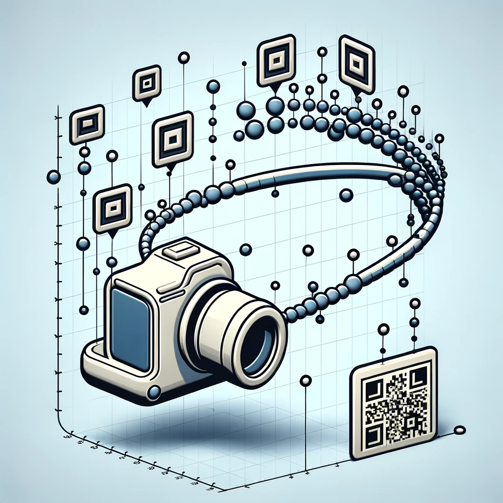
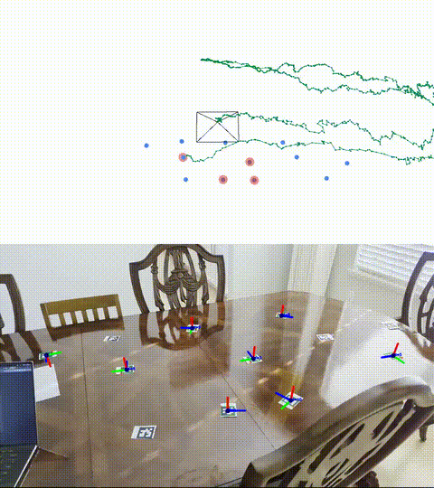

<div align=center>
  
</div>

  
<h1 align="center">ArUco SLAM</h1>


<div align=center>

[](https://github.com/dwyl/esta/issues)
[](https://github.com/astral-sh/ruff)
[](https://opensource.org/licenses/MIT)

<!-- [](https://github.com/psf/black)
[](http://www.pydocstyle.org/en/stable/) -->


  **Using various algorithms to perform SLAM with a monocular camera and visual markers.** 


</div>

## About

**ArUco** markers are a type of fiducial marker commonly used in computer vision applications, especially because they are built into OpenCV. Since their size is known, their corners can be used with the PnP algorithm to estimate their pose in the camera frame. Additionally, ArUco markers individually encode an ID. Together, these properties make them ideal for SLAM applications.

**SLAM** stands for Simultaneous Localization and Mapping. This means that the system can localize itself in an environment while simultaneously building out its understanding of that environment. This project detects the position and orientation of ArUco markers in a video feed, inserts those markers into a map, and then uses various methods to optimize the estimates for both the camera and marker positions. In the video above, all markers are placed randomly; before the first frame is processed, there is no information about their positions.

**Why is this important?** SLAM is a fundamental problem in robotics and computer vision. It is used in self-driving cars, drones, and augmented reality applications. Will this project be used in any of those applications? Probably not. But it is a fun and challenging problem to work on.

## Extended Kalman Filter:

#### With an MEKF for orientation.

Due to (non-linear) rotations of the camera, a Kalman Filter cannot be used. 

Likewise, quaternions are ***not vectors***, so we can't use the additive updates of the EKF. Instead, we will use the Multiplicative EKF (MEKF) in parallel for orientation. You can find the original paper for the MEKF [here](
  https://ntrs.nasa.gov/api/citations/20040037784/downloads/20040037784.pdf) as well as a great explanation [here](https://matthewhampsey.github.io/blog/2020/07/18/mekf). You'll find below that the orientation is represented by a quaternion and an error quaternion (paramaterized by 3 error parameters).

This implementation very briefly results in some instability. I'm not sure why and I'm debugging it.

The key components of the Extended Kalman Filter are as follows:
- **State Vector**: the 3D pose (tanslation and quaternion) of the camera, along with the 3D position of each ArUco marker (all in the map frame):
  - camera:
    - $x_{cam}, y_{cam}, z_{cam}, qx_{cam}, qy_{cam}, qz_{cam}, qw_{cam}, ex_{cam}, ey_{cam}, ez_{cam}$
  - marker $i$:
    - $x_{mi}, y_{mi}, z_{mi}$
  - Putting the components together, the state vector will have be $3n + 10$ dimensions, for $n$ landmarks
- **Measurement** Vector: the 3D position of each ArUco marker in the camera frame:
  - ${}^{cam}x_{mi},{}^{cam}y_{mi},{}^{cam}z_{mi}$    


- **State Transition**: For the motion model, we use a moving average of the last $n$ displacements to predict the camera's position motion. Since markers are static, we do not update their state:
  - $X_{k|k-1} = X_{k-1|k-1} + \frac{X_{k-1|k-1} - X_{k-n|k-n}}{n}$

- **Measurement Model**: in order to model what we will measure, we get the displacement between the landmark and the camera positions ($X$), and then rotate it to put it in the camera frame:
  - ${}^{cam}X_{marker} = {}^{cam}R_{map} \cdot ({}^{map}X_{marker} - {}^{map}X_{cam})$
 
There is an excellent explanation by Cyrill Stachniss for a similar, 2D example that can be found [here](https://www.youtube.com/watch?v=X30sEgIws0g) [1].

`python3 run_slam.py --filter ekf`
  

<details>
  <summary><strong>Visualization</strong></summary>
  

</details>


## Factor Graph:
<div align="center">
  
  <p><em>Image credit: GTSAM [2]</em></p>
</div>

A factor graph optimizes the joint probability:

<div align="center">

$P(X \mid Z) \propto \prod_{i} \phi_i(X_i, Z_i)$
</div>

Where:
- $X$: the camera poses and the landmark positions.
- $Z$: the measured landmark poses in the camera frame.
- $\phi_i$: the factor that relates one camera pose to the next as well as each 
camera pose to the landmark that were seen at that time.

In other words, we can estimate the camera and landmark positions by optimizing 
the posterior probability.

The factor graph does not currently use a motion model; it simply uses the last position with a large uncertainty. I tried the motion model, but there was a large instability.

My implementation leverages GTSAM with the ISAM2 solver, following the 
postulation above. It reconstructs the graph at each timestep, maintaining 
conciseness while also accounting for both the local environment and historical
constraints.

`python3 run_slam.py --filter factorgraph`

<details>
  <summary><strong>Visualization</strong></summary>

This is the same as the gif shown at the top of the README.
  

</details>

<!-- 
## Particle Filter

<div align="center">
  
  <p><em>Image credit: Wikimedia Commons</em></p>
</div> -->

## Orientation Ambiguities

Due to possible ambiguities in ArUco orientation estimation, only marker 
positions are used (hence why they are represented as points). These 
orientation ambiguities can be seen in the video (`z` axis flipping) and are 
discussed more thoroughly in 
[this OpenCV github issue](https://github.com/opencv/opencv/issues/8813). In 
the future, I may opt to use the stable `x` and `y` dimensions as part of the 
state for better results.

## Installation

```
sudo apt-get install mesa-utils libglew-dev
git clone --recursive https://github.com/yishaiSilver/aruco-slam.git
cd aruco-slam
pip install -r requirements.txt
cd thirdparty/pangolin
mkdir build
cd build
cmake .. -DPython_EXECUTABLE=`which python` -DBUILD_PANGOLIN_FFMPEG=OFF
make -j8
cd ../..
python pangolin_setup.py install
cd filterpy
python setup.py install
cd ../..
```

Please ensure that you have properly calibrated your camera.

## TODOs

- [x] ArUco Detection, Pose Estimation 
- [x] Moving Average Motion Model (EKF)
- [x] EKF
- [ ] Non-Additive Quaternions in EKF (MEKF)
- [ ] UKF
- [ ] Iterative EKF
- [x] Factor Graph
- [ ] Particle Filter
- [x] 3D Visualization
- [x] Map Saving
- [x] Map Loading
- [x] Trajectory Saving
- [ ] Partial Angle State

Nice To haves:
- [ ] Ground Truth Comparison
- [ ] Duplicate Marker ID Handling
- [ ] Non-Static Landmark Tracking
- [ ] Orientation Ambiguity Resolution

## References

[1] Cyrill Stachniss. (2020, October 2). EKF-SLAM (Cyrill Stachniss). YouTube. https://www.youtube.com/watch?v=X30sEgIws0g

[2] Dellaert, F., & GTSAM Contributors. (2022, May). *borglab/gtsam* (Version 4.2a8) [Software]. Georgia Tech Borg Lab. https://doi.org/10.5281/zenodo.5794541

[3] uoip. (2018, January 23). Pangolin. GitHub. Retrieved December 6, 2024, from https://github.com/uoip/pangolin